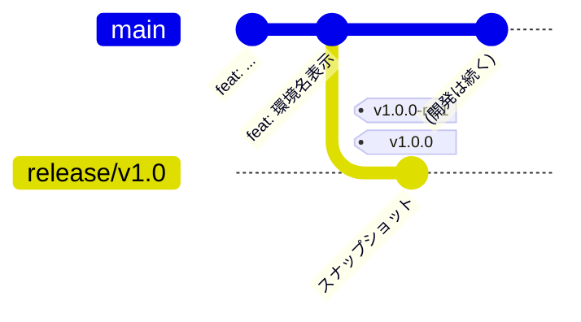

# 第3章 v1.0 リリース

いよいよ出荷です。この章の流れ:



1. `main` から `release/v1.0` を切る (出荷内容のスナップショット)
2. `v1.0.0-rc.1` タグ → **唯一のビルド** → Pre-release 作成 → staging 自動デプロイ
3. staging で検品
4. **同一コミット**に `v1.0.0` タグ → 検証と昇格のみ (再ビルドなし) → 承認 → production

この章のゴールは、**GA のワークフローにビルドが存在しないこと**と、
**staging と production がバイト単位で同一のアーティファクトであること**を
自分の目で確認することです。

## 3.1 リリースブランチを切る

```bash
git switch main && git pull
git switch -c release/v1.0
git push -u origin release/v1.0

# push が origin に届いたか確かめる (SHA が 1 行返れば OK)
git ls-remote --exit-code --heads origin release/v1.0
```

> [!IMPORTANT]
> **`git ls-remote` が何も返さないまま先に進まないでください。** 次の 3.2 で打つ RC タグは
> 「origin の `release/*` ブランチ上のコミットであること」をワークフローが検証します。
> ブランチが origin に無いままタグだけ push すると、そのコミットはどのリリースブランチにも
> 含まれていないため、**Verify tag points to a release/\* branch で必ず失敗します**。
> 失敗の原因はタグではなくブランチなので、タグを打ち直しても直りません。ブランチを
> push したうえで、Actions から失敗した実行を **Re-run** すれば復旧できます。

> [!NOTE]
> リリースブランチは「これから出荷するもの」を main の開発の流れから
> 切り離して凍結するためのものです。この後 main に何がマージされても
> v1.0 の出荷内容には影響しません。バージョンを上げるためのコミット
> (version bump) は不要です — バージョンはタグからビルド時に注入されます。

> [!TIP]
> push が `GH013: Repository rule violations found` (`4 of 4 required status checks
> are expected`) で拒否される場合、Ruleset が古い世代のままです。
> `./scripts/setup-github.sh <mode>` (`solo` または `pair <レビュアー名>`) を
> 再実行してから push し直してください。このスクリプトは冪等で、既存の Ruleset を
> 上書きするだけなので、何度実行しても問題ありません。

## 3.2 RC タグを打つ

タグは「今いるコミット」に付きます。origin の `release/v1.0` の先端と同じコミットに
いることを確かめてから打ちます。

```bash
git switch release/v1.0
git fetch origin

# 2 行が同じ SHA であること (ローカルの先端 = origin の先端)
git rev-parse HEAD origin/release/v1.0

git tag v1.0.0-rc.1
git push origin v1.0.0-rc.1
```

Actions で `Release RC` が起動します。実行内容をログで追ってください:

1. **Verify tag points to a release/\* branch** — RC タグが release ブランチ上の
   コミットであることの検証。💥 試しに main 上のコミットに `v9.9.9-rc.1` を
   打って push すると、ここで fail します (確認したらワークフローは失敗のまま
   でよいので、ローカルとリモートのタグを `git push --delete origin v9.9.9-rc.1`
   と `git tag -d v9.9.9-rc.1` で消しておきましょう。**GA タグと違い、RC 検証で
   失敗したタグの削除はこのチュートリアルの保護対象 `v*` に含まれるため、
   Ruleset を一時的に無効化する必要があります** — これも第5章のネタです)
2. **Build & push backend image** — ここが全リリース工程で唯一の docker build
3. **Build frontend / Package** — 同じく唯一の npm build。tar.gz + sha256 を生成
4. **Create Pre-release** — Releases に `v1.0.0-rc.1` が Pre-release として作られ、
   `dist-v1.0.0-rc.1.tar.gz` / `checksums.txt` / `release-manifest.json` が添付される
5. **Deploy to staging** — Lambda へは `<repo>@sha256:...` の digest 参照でデプロイ

Release の本文には、backend の image digest に続いて **What's Changed** が
自動生成されています (`gh release create --generate-notes`)。ここに並ぶのは
このリリースに入ったマージ済み PR で、`.github/release.yml` の定義に従って
🚀 Features / 🐛 Bug Fixes / 🧹 Maintenance にカテゴリ分けされます。カテゴリの
判定材料は PR のラベルで、それは PR タイトルの `feat:` / `fix:` などから
`PR Label` ワークフローが `type: feat` / `type: fix` として自動で付けたものです
(ラベル名は Conventional Commits の type そのままにしてあります)。
**リリースノートは書くものではなく、規約に従った PR タイトルの結果として
出てくるもの**、という関係になっています。

## 3.3 staging で検品する

staging の URL を開きます。確認ポイント:

- 環境チップが `staging`
- frontend / backend ともに `version: 1.0.0` — **`-rc.1` が付いていない**ことに注目。
  アーティファクトには基底バージョンだけを焼き込み、「RC か GA か」はタグと
  Release の属性 (Pre-release かどうか) で管理します。GA になった瞬間に中身が
  同一であるために、これが必要です
- `git_sha` が `release/v1.0` の先端コミットと一致
- 「検品合格」スタンプが押されている

Releases ページの `release-manifest.json` も開いて、backend の image digest を
控えておいてください (後で答え合わせします)。

## 3.4 GA タグを打つ

検品 OK なら、**RC とまったく同じコミット**に GA タグを打ちます。

```bash
git switch release/v1.0 && git pull
git tag v1.0.0        # 今 HEAD = v1.0.0-rc.1 と同一コミットのはず
git push origin v1.0.0
```

`Release GA` ワークフローが起動し......**途中で止まります**。

## 3.5 承認ゲート

Actions の実行画面を開くと `ga` ジョブが **Waiting for review** になっています。
これは GitHub Environment `production` の必須レビュアー設定によるものです。

> [!IMPORTANT]
> ここで止まっている間、ワークフローは production 用の AWS ロールを assume
> できていません。IAM ロールの信頼ポリシーが `environment:production` の OIDC
> トークンを要求しており、そのトークンは承認を通過しないと発行されないから
> です。つまり承認ゲートは「手順上の関所」ではなく **AWS の権限そのもの**です。

**Review deployments** ボタンから `production` にチェックを入れて Approve します。

<details>
<summary>▶ ペア/研修モードの場合</summary>

承認できるのはセットアップ時に指定したレビュアーだけです。タグを push した本人の
画面には承認ボタンが出ない (または押せない) ことを確認してから、レビュアーに
承認してもらってください。

</details>

## 3.6 GA ワークフローを読む

承認後の実行ログで、**何が行われて何が行われていないか**を確認します。

- **Find matching RC & verify same commit** — `v1.0.0-rc.1` を発見し、GA タグと
  同一コミットであることを検証
- **Promote backend image** — `crane tag` で既存イメージの digest に `v1.0.0` タグを
  追加しただけ。ログに `RC と GA は同一 digest: sha256:...` と出ています。
  3.3 で控えた digest と一致しているはずです
- **Download RC frontend artifact & verify checksum** — RC の tar.gz を取得し
  `sha256sum -c` で検証。**再ビルドしていない**
- **Resolve previous GA tag** — 自動生成ノートの差分基準タグを決定。GitHub は
  既定で「直前のリリース」を基準にするため、放っておくと `v1.0.0` のノートが
  「同一コミットの `v1.0.0-rc.1` からの差分 = 空」になってしまう。直前の **GA**
  タグ (今回は初 GA なので無し = 既定に委ねる) を明示して、これを避けています
- **Create GA release** — RC と同じアセットを添付した正式 Release を作成。
  本文は RC からの昇格である旨 + digest に、自動生成された What's Changed が続く
- どこにも `docker build` / `npm run build` が**存在しない**

ECR コンソールでも見てみましょう。`v1.0.0-rc.1` と `v1.0.0` の 2 つのタグが
**同一の digest** を指しています。CLI なら:

```bash
aws ecr describe-images \
  --repository-name $(terraform -chdir=terraform output -raw ecr_repository_name) \
  --query 'imageDetails[].{tags:imageTags,digest:imageDigest}' --output table
```

## 3.7 最終検品: staging と production を並べる

staging と production の URL を 2 つのウィンドウで並べて開いてください。

- 環境チップ以外、**表示内容が完全に一致**している (version / git_sha / image_digest)
- どちらも「検品合格」

これが build once / deploy many の完成形です。staging で検証したバイナリと
本番で動くバイナリが同一物であることを、票の突き合わせだけで説明できます。

## 3.8 チェックポイント

- [ ] `release/v1.0` が存在し、main とは独立している
- [ ] Releases に Pre-release `v1.0.0-rc.1` と Release `v1.0.0` があり、アセットが同一
- [ ] ECR で 2 タグが同一 digest を指している
- [ ] GA の実行ログにビルドステップがない
- [ ] staging と production の検品票が完全一致

なお main では開発が続けられます。試しに第1章の要領で適当な PR を 1 つ
マージしてみてください。dev だけが更新され、v1.0 系には何の影響もないことが
確認できます (この状態は第4章の前提にもなります)。

---

← [第2章 ガードレール体験](./02-guardrails.md) | [第4章 バックポート →](./04-backport.md)
