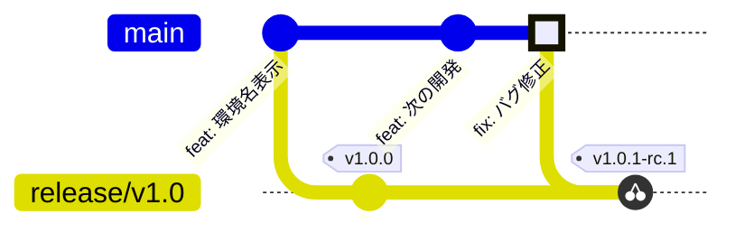

# 第4章 upstream first とバックポート

シナリオ: v1.0.0 が本番稼働中、main では次バージョンの開発が進んでいます
(第3章の最後で PR を 1 つマージしていれば、すでに main と release/v1.0 は
分岐しています)。ここで本番のバグが見つかりました。



原則は **upstream first**: 修正はまず main に入れ、それをリリースブランチへ
cherry-pick します。逆順 (リリースブランチだけ直す) にすると、次のリリースで
同じバグが再発する事故が起きます。

## 4.1 バグを発見する

今回の「バグ」はこれです: 検品票の判定スタンプが、不一致のとき `不一致` と
表示されますが、本来の仕様は `検品不合格` でした——ということにします。

`frontend/src/App.tsx`:

```tsx
        <div className={`stamp ${allMatch ? "stamp-ok" : "stamp-ng"}`} role="status">
          {allMatch ? "検品合格" : "不一致"}    {/* ← "検品不合格" が正 */}
        </div>
```

バグ報告の Issue を作ります。

```bash
gh issue create \
  --title "不一致時のスタンプ表記が仕様と異なる" \
  --body "「不一致」ではなく「検品不合格」と表示するのが正。v1.0 系にもバックポートが必要"
```

## 4.2 まず main を直す (upstream first)

第1章とまったく同じ日常フローです。

```bash
git switch main && git pull
git switch -c fix/3-stamp-label
# App.tsx の「不一致」を「検品不合格」に修正
git add -A && git commit -m "スタンプ表記修正"
git push -u origin fix/3-stamp-label
gh pr create --title "fix: 不一致時のスタンプ表記を仕様どおりに修正" --body "Closes #3"
gh pr checks --watch
gh pr merge --squash
```

merge 後、**squash されたコミットの SHA** を控えます。

```bash
git switch main && git pull
git log --oneline -1
# 例: 9f8e7d6 fix: 不一致時のスタンプ表記を仕様どおりに修正 (#4)
```

## 4.3 release/v1.0 へ cherry-pick する

リリースブランチも Ruleset で保護されているため、直 push はできません。
バックポートも **PR 経由**です。

```bash
git switch release/v1.0 && git pull
git switch -c backport/v1.0-stamp-label
git cherry-pick -x 9f8e7d6      # ← 4.2 で控えた SHA
git push -u origin backport/v1.0-stamp-label
```

> [!TIP]
> `-x` を付けると、コミットメッセージに `(cherry picked from commit ...)` が
> 追記され、main のどのコミット由来かの追跡が残ります。

バックポート用テンプレートを使って、**base を release/v1.0 にした** PR を作ります。

```bash
gh pr create \
  --base release/v1.0 \
  --title "fix: 不一致時のスタンプ表記を仕様どおりに修正 (backport v1.0)" \
  --body "$(sed -e 's/#<!--.*-->/#4/' .github/PULL_REQUEST_TEMPLATE/backport.md)"
```

(UI で作る場合は PR 作成 URL の末尾に `?template=backport.md` を付けると
テンプレートが読み込まれます。base ブランチの選択を忘れずに)

CI 通過後、squash merge します。

```bash
gh pr merge --squash
```

<details>
<summary>▶ ペア/研修モードの場合</summary>

バックポート PR のレビュー観点は通常 PR と異なります。「修正内容が正しいか」は
main 側 PR で審査済みなので、ここでは **(1) 元 PR と差分が一致しているか、
(2) 余計な変更が紛れ込んでいないか、(3) 対象ブランチが正しいか** だけを
確認して Approve してください。

</details>

## 4.4 v1.0.1 をリリースする

第3章と同じ手順の 2 周目です。今度はガイドなしでどうぞ。

```bash
git switch release/v1.0 && git pull
git tag v1.0.1-rc.1 && git push origin v1.0.1-rc.1
# → staging で検品 (スタンプ表記の確認は、わざと不一致にできないので
#   Releases のアセット diff や git_sha 更新で確認)
git tag v1.0.1 && git push origin v1.0.1
# → 承認 → production
```

## 4.5 チェックポイント

- [ ] main に fix が入って dev に反映された (スタンプ仕様は次期バージョンでも直っている)
- [ ] `release/v1.0` には cherry-pick の 1 コミットだけが追加された
      (`git log --oneline main..release/v1.0` で確認 — 次期開発のコミットが**混ざっていない**)
- [ ] production の検品票が `version: 1.0.1` になった
- [ ] main 側の開発内容 (第3章末の PR) は production に**出ていない**

最後の 2 点が、リリースブランチ方式の価値そのものです:
**修正だけを、開発中の変更を巻き込まずに出荷できました**。

---

← [第3章 v1.0 リリース](./03-release.md) | [第5章 発展演習 →](./05-advanced.md)
