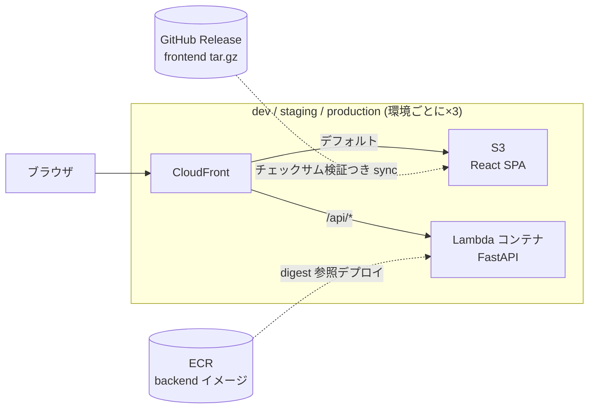
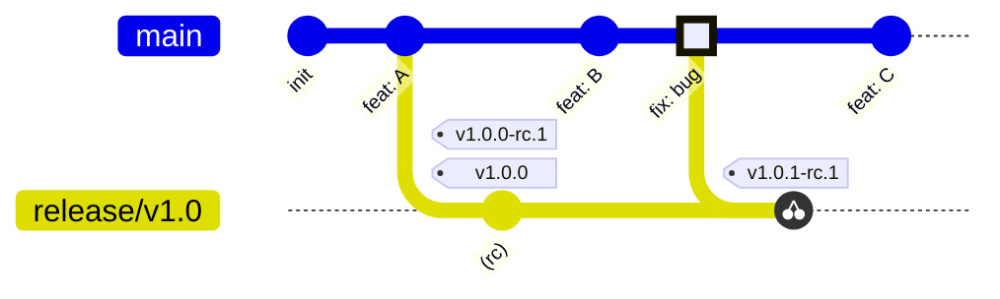

# ハンズオン: 開発〜リリースワークフローを一周する

このチュートリアルでは、実際に AWS 上へアプリケーションをデプロイしながら、
trunk-based 開発とバージョン駆動リリースのワークフローを一周します。

## 学べること

- feature ブランチ → Conventional Commits な PR → squash merge → dev 自動デプロイの日常フロー
- Rulesets やリポジトリ設定が「規約違反を物理的に不可能にする」仕組み
- release ブランチ + RC タグ → staging 検証 → GA 昇格 → production の出荷フロー
- **build once / deploy many**: RC で 1 回だけビルドし、GA では digest / チェックサム検証つきで昇格のみ行う
- **upstream first**: バグ修正を main に先に入れてからリリースブランチへ cherry-pick する

## 対象読者と所要時間

Git と PR の基本操作ができる人向け。**参加者は AWS の画面を触りません。**管理者から
アクセスキーと `owner` を受け取って Codespaces に設定するところから始めます。

| 章 | 内容 | 目安 |
|---|---|---|
| [第0章 セットアップ](./00-setup.md) | AWS / GitHub の環境構築 | 30–45分 |
| [第1章 フィーチャー開発](./01-feature-flow.md) | PR → squash merge → dev 自動デプロイ | 45分 |
| [第2章 ガードレール体験](./02-guardrails.md) | わざと違反してブロックされる | 30分 |
| [第3章 v1.0 リリース](./03-release.md) | RC → staging 検品 → GA 昇格 → production | 60分 |
| [第4章 バックポート](./04-backport.md) | upstream first と v1.0.1 パッチリリース | 45分 |
| [第5章 発展演習](./05-advanced.md) | 検証をわざと壊す / ロールバック ほか | 任意 |
| [終章 後片付け](./99-cleanup.md) | リソース削除 | 10分 |

**演習環境を用意する人、または自分の AWS アカウントで一人で演習する人**は、先に
[管理者ガイド](./90-admin.md) を読んでください。IAM ユーザーの作り方、必要な権限、
1 つの AWS アカウントを複数人で共有する方法をまとめています。

## デプロイするもの

「出荷検品票」ダッシュボードです。フロントエンド自身のバージョン情報と、
バックエンド API (`/api/version`) が返すバージョン情報を並べて表示し、
一致していれば「検品合格」のスタンプが押されます。

バックエンドは **ECR のコンテナイメージ**、フロントエンドは **GitHub Release のアセット
(tar.gz + sha256)** という 2 種類のアーティファクトを扱います。どちらも「RC で 1 回だけ
作り、GA では同一物であることを検証して昇格する」という同じ原則で動きます。

## ワークフロー全体像

- `main` = トランク。すべての変更は PR の squash merge で入り、push のたびに dev へ自動デプロイ
- `release/vX.Y` = 出荷用スナップショット。RC タグでビルド + staging、GA タグで production へ昇格
- バグ修正は main が先 (upstream first)。リリースブランチへは cherry-pick でバックポート

## 進め方

各章は前の章の状態を前提に進みます。順番どおりに進めてください。
「💥 わざと失敗させる」と書かれた手順は、**エラーが出れば成功**です。

一人で進める場合は `solo` モード、二人以上なら `pair` モードでセットアップします
(第0章で選択)。ペアモードの追加手順は各章の折りたたみ (▶) に書いてあります。

→ [第0章 セットアップ](./00-setup.md) から始めましょう。
